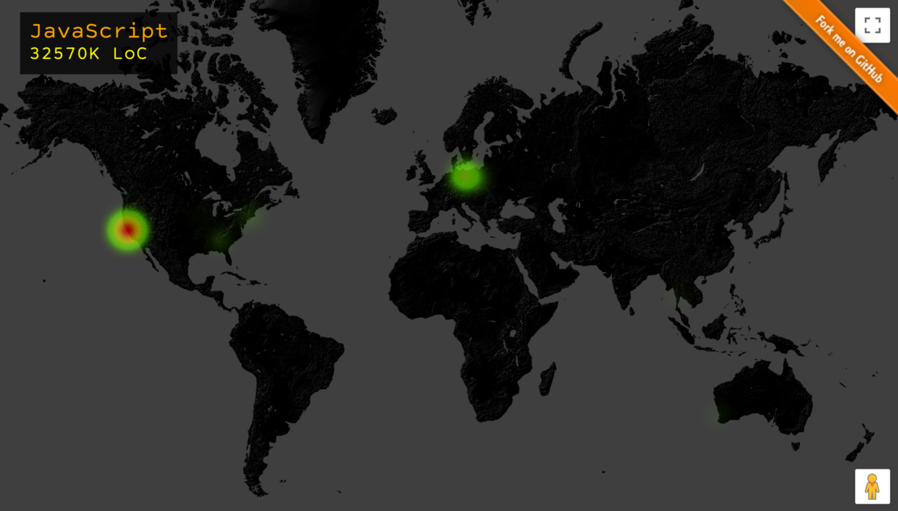
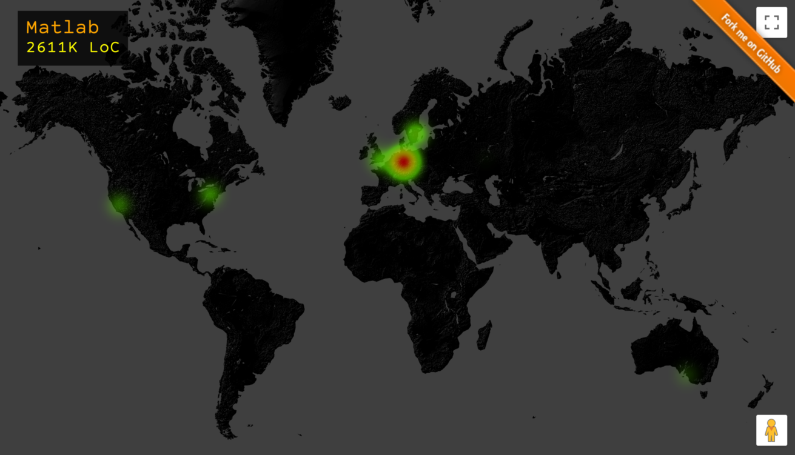
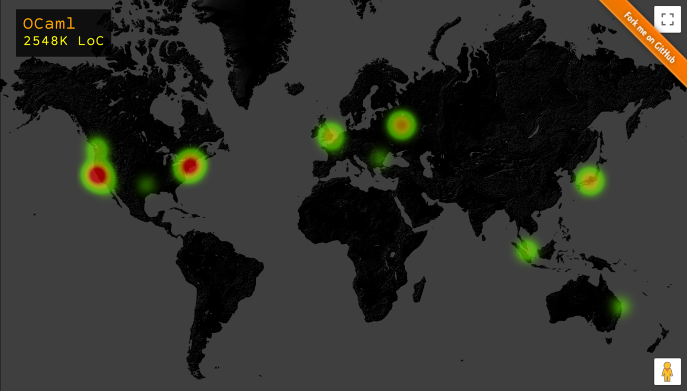
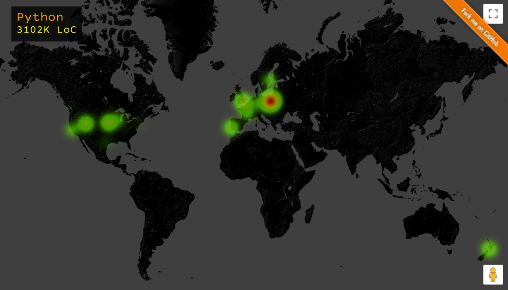
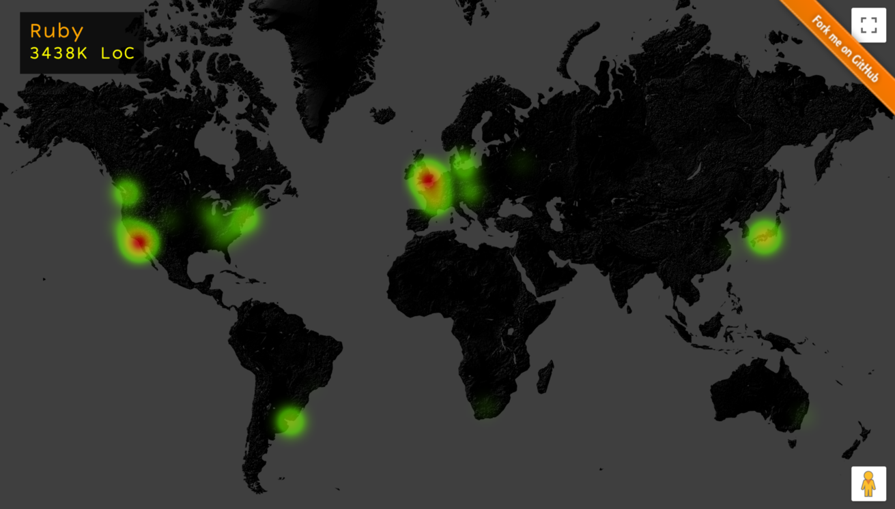
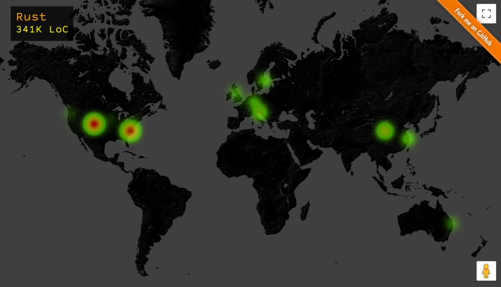
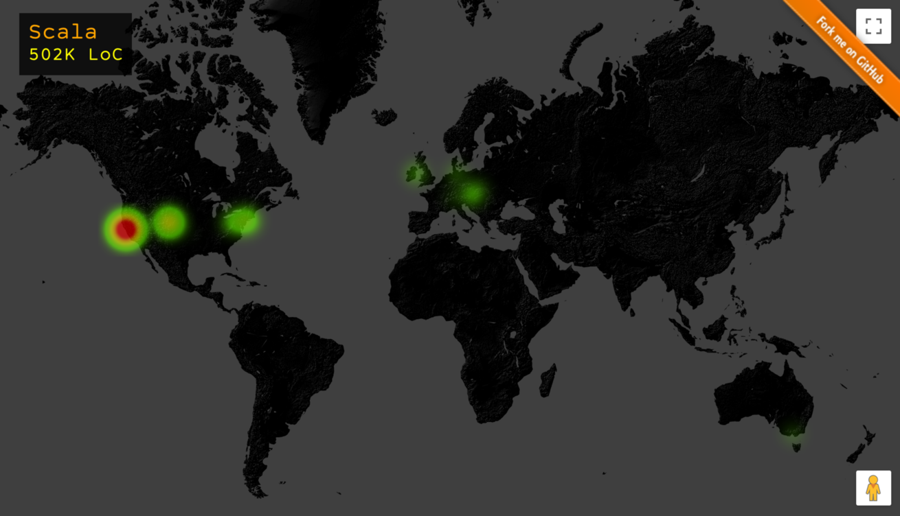
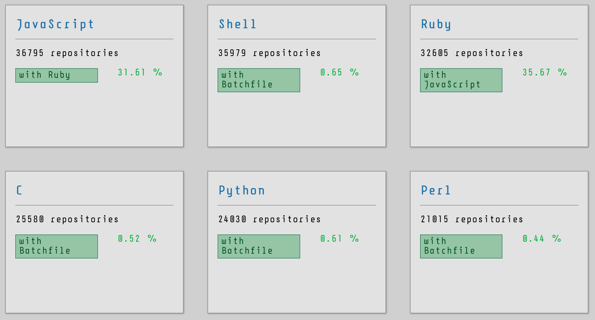
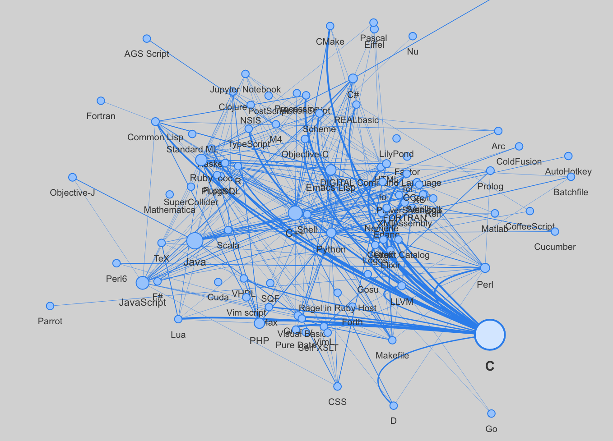

# Git Regional Languages

> Have you ever wonder how the geospatial distribution of the programming 
languages would look like? I do so I made this.

---

## Synopsis

More famous languages may be written everywhere 
in the world, yet the languages with lesser users 
may probably tend to be epidemic or popular 
in some particular regions. Let's find out.

---







---

## Getting started

Prerequisites:

- [x] Python3.7+
- [x] MongoDB 3.0+
- [x] Node.js 4.x+

- [x] Github API access token
- [x] GoogleMap API key
- [x] Scala with SBT build tool
- [x] Apache Spark (local instance)


Since it uses [github API](https://developer.github.com/v3), 
you'll need to supply your access token. 
Create a text file named `API-TOKEN` in the root directory 
of this repository and put your Github login ID 
and your access token in the following line like so:

```
johndoeagain
f00ba478293cbbae0a6552
```

Also, [GoogleMap API key](https://developers.google.com/maps/documentation/geocoding/get-api-key) is also required for geocoding 
API access. You'll need to generate your own API key 
can place it in a text file named `GOOGLE-API-KEY`, 
put it in the root directory of the repo.

>Obtain your Google API key here: https://console.developers.google.com/project/_/apiui/credential. Also make sure you have **GoogleMap API** enabled for this credential.

### Prepare your MongoDB

To set your data storage, create a DB named `gitlang`. 
Don't need to create any initial collection because 
the script will do it for you.

>**CAVEAT** It really requires a huge capacity to 
store the data and you can make [up to 5000 requests](https://developer.github.com/v3/#rate-limiting) 
in a span of one hour.

---

## Download GitHub data

> You can skip this, the distribution data is ready out of the box.

Run the following script to download a batch of repository data 
via Github API:

```
$ python3 download.py
```

**NOTE:** Adjust the number of batch, the range of repos to download 
right in the file `download.py` yourself. 
The script will download the batch repository data and 
store them in the MongoDB.

| DB/Collection | data storage |
|------------------|----------------|
| gitlang/repos | Github repositories data with the location of owners |
| gitlang/geo | Mapping between geolocation and territory |

**2nd NOTE:** This project is based on [Github API v3](https://developer.github.com/v3/?) even though the next generation using [GraphQL API](https://developer.github.com/v4/) has been rolled out. 


---

## Generate geographical distribution of languages

We have a script to process the entire bulk of downloaded repository 
data in MongoDB, generate the geospatial distribution of languages 
written in each repository. Execute the following script:

```
$ node process.js --dist
```

>**Why Node?** 
>
> In case a question has popped up in your mind, 
> Node.js natively communicates with `MongoDB` and 
> JavaScript works well with `GoogleMAP API`. That's why.

### What process.js --dist does?

Following tasks are sequentially run:

1. Maps repository data from the collection `repos` to distributions of languages by regions, store them in the collection `distLangByRegion` and list all regions in `regions`.

2. Fetches *Geolocations* of all regions of repos.

3. Saves all Geolocations to MongoDB: collection `geo`.

4. Aligns all languages available in `distLangByRegion` with the geospatial distribution data. Maps the output in to the JS file under `html\js\dist.js`.

5. Saves the **GoogleAPI Key** to `html/js/gapi.js`.

---

## See the geospatial distribution visualisation

After having the entire processes run correctly in sequence 
as described eariler, the output HTML is ready to access via:

```
html/index.html
```

Just open it up in your favourite browser to see the visualisation.







### Why my languages don't display any heatmap?

In case there exists some repositories on Github which 
are written in a particular language, it will be listed. 
However, we are unable to spot where the code has been written 
if the authors of those repositories don't indicate 
their location in their profile. That's why some languages 
are left unplotted even though they are correctly listed.


---

## Generate language correlation

One repository may likely contain more than one language. To find out which languages co-exist in the same repository the most, generate the correlation by running:

```
$ node process.js --corr
```

### View the correlation

After the process finished, we can view the output at:

```
html/correlation.html
```



---

## Generate the language graph

To generate the relational graph of languages, run the following command.

```
$ node process.js --graph
```

Then the graph can be viewed in the following file.

```
html/graph.html
```



---

## License

MIT


